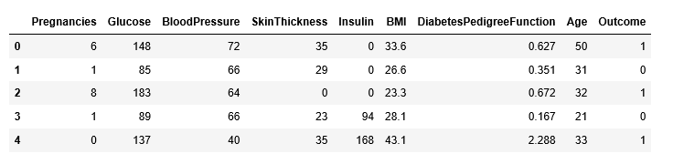

# Diabetes Prediction using Deep learning
## Dataset
===
**Source:** "[Raw Data](https://raw.githubusercontent.com/susanli2016/Machine-Learning-with-Python/master/diabetes.csv)"

**Description:**

* *Features**
* *Pregnancies*: Number of times pregnant
* *Glucose*: Plasma glucose concentration over 2 hours in an oral glucose tolerance test
* *BloodPressure*: Diastolic blood pressure (mm Hg)
* *SkinThickness*: Triceps skin fold thickness (mm)
* *Insulin*: 2-Hour serum insulin (mu U/ml)
* *BMI*: Body mass index (weight in kg/(height in m)2)
* *DiabetesPedigreeFunction*: Diabetes pedigree function (a function which scores likelihood of diabetes based on family history)
* *Age*: Age (years)
* **Output**: Class Variable(0, if non-diabetic and 1, if diabetic)

## Data Sample

## Model

   A 4-Layered Deep Neural network is implemented. Normalized data is fed into the NN and using backpropagation the weights are adjusted to make the model learn.
   

## Result
===

Accuracy on **train set**: 83%
Accuracy on **test set**: 79%

